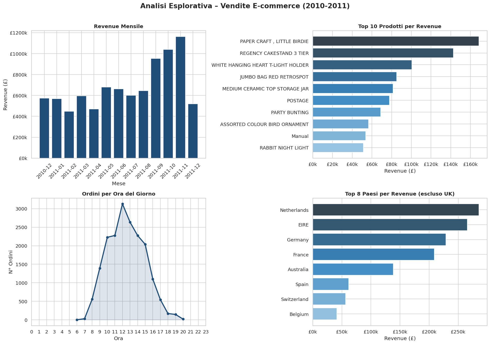

# E-commerce Sales Analysis

Exploratory data analysis on a real retail dataset (541,000+ transactions)
to identify revenue trends, top products and customer behavior.

## Technologies
Python, Pandas, Matplotlib, Seaborn

## What the analysis covers
- Data cleaning and normalization
- Monthly revenue trend
- Top 10 products by revenue
- Orders by time of day
- Top countries by revenue

## Output

